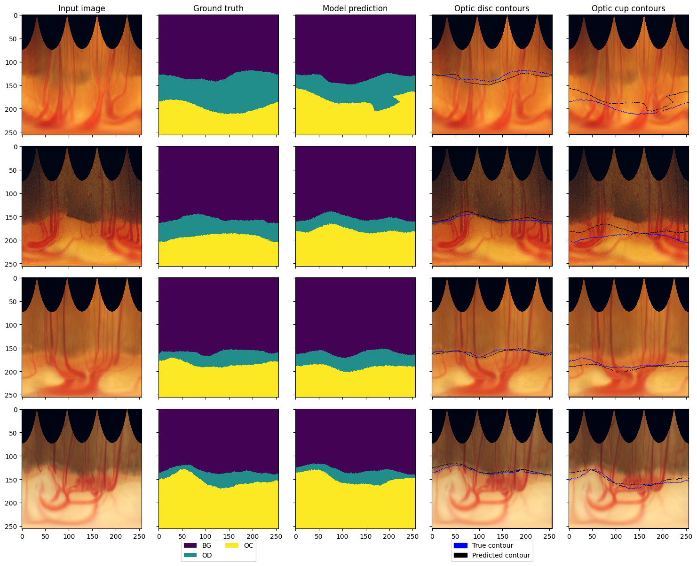
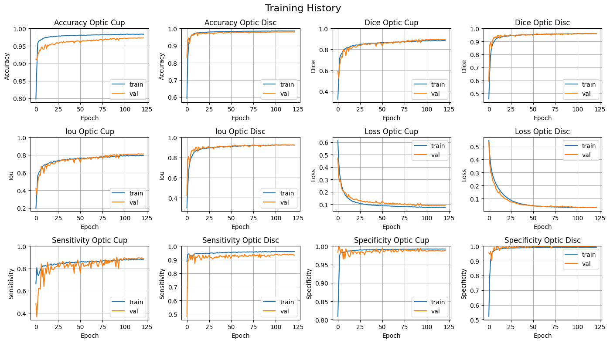

# [Master's Thesis - Glaucoma Segmentation](https://github.com/AkosKappel/DP-GlaucomaSegmentation)

Author: **Bc. Ákos Kappel**

Thesis Title: **Neural network based semi-automatic segmentation methods to enhance the detection and monitoring of human eye diseases**

Study Programme: **Intelligent Software Systems**

Year: **2022 - 2024**

Supervisor: **doc. RNDr. Silvester Czanner, PhD.**

Institution: **Faculty of Informatics and Information Technologies, Slovak University of Technology in Bratislava**


## Contents

1. [Introduction](#introduction)
2. [Installation](#installation)
    - [Exploratory Data Analysis](#exploratory-data-analysis)
    - [Preprocessed Dataset](#preprocessed-dataset)
    - [Pretrained Models](#pretrained-models)
3. [Usage](#usage)
    - [Region of Interest detection with CenterNet](#region-of-interest-detection-with-centernet)
    - [Cascade architecture](#cascade-architecture)
        - [Model training](#model-training)
        - [Model evaluation](#model-evaluation)
        - [Inference](#inference)
    - [Dual-decoder architecture](#dual-decoder-architecture)
        - [Model training](#model-training-1)
        - [Model evaluation](#model-evaluation-1)
        - [Inference](#inference-1)
4. [Results](#results)
5. [Interpretability](#interpretability)
    - [Probability map](#probability-map)
    - [Activation map](#activation-map)
    - [Grad-CAM](#grad-cam)


## Introduction

This repository contains the code for my Master's thesis project at the *Faculty of Informatics and Information Technologies, Slovak University of Technology in Bratislava* ([FIIT STU](https://www.fiit.stuba.sk/)).
The project is focused on the development of a deep learning model for the segmentation of the optic disc and cup in fundus images.
The model is trained on the [ORIGA](https://pubmed.ncbi.nlm.nih.gov/21095735/) dataset and evaluated on the [DRISHTI-GS](https://cvit.iiit.ac.in/projects/mip/drishti-gs/mip-dataset2/Home.php) dataset.
The goal of the project is to propose, implement and evaluate 2 novel segmentation architectures for the task of glaucoma segmentation:

1. **[Cascade architecture](#cascade-architecture)** - a two-stage segmentation model, where the first stage segments the optic disc and the second stage segments the optic cup, conditioned on the optic disc segmentation.
2. **[Dual-decoder architecture](#dual-decoder-architecture)** - a single-stage segmentation model with two decoder branches, where the first decoder segments the optic disc and the second decoder segments the optic cup, while sharing the encoder features.

The project is implemented in [Python](https://www.python.org/) 3.10.2 using the [PyTorch](https://pytorch.org/) 2.0.1 deep learning framework, and other libraries such as [NumPy](https://numpy.org/), [Pandas](https://pandas.pydata.org/), [Matplotlib](https://matplotlib.org/), [OpenCV](https://opencv.org/) and [Albumentations](https://albumentations.ai/).


## Installation

To install the project, you need to have Python 3.10 installed on your system.
You can install the project dependencies using the following commands:

```bash
# clone github repository   
git clone https://github.com/AkosKappel/DP-GlaucomaSegmentation
cd DP-GlaucomaSegmentation

# create new virtual environment
python3 -m venv venv

# activate virtual environment
venv/Scripts/activate # Windows
# or
source venv/bin/activate # Linux

# install dependencies
pip install -r requirements.txt
```


### Exploratory Data Analysis

As part of the project, we performed an EDA on the dataset, to better understand the data characteristics and potential challenges.
The jupyter notebooks with the EDA can be found in the `./EDA` directory.
The main issues we identified during the EDA were:

- **Class imbalance** - the dataset contains a lot of background pixels compared to the optic disc and cup pixels.
- **Variability in image quality** - the images have different resolutions, brightness, contrast, and artifacts.


### Preprocessed Dataset

The dataset images and masks are not included in this repository.
If you want to use our cropped and preprocessed data, you can download it from [here](https://drive.google.com/file/d/1u0d_et2O_wA1HCw6aS5c4ii6t0ilx9q1/view?usp=sharing).
After downloading the data, extract the zip file to the `./data` directory.
The dataset contains the following structure:

```bash
data
├── ORIGA
│   ├── CenterNet (preprocessed data for CenterNet)
│   │   ├── TrainImages
│   │   ├── TrainMasks
│   │   ├── TestImages
│   │   └── TestMasks
│   ├── ROI (detected regions of interest)
│   │   ├── TrainImages
│   │   ├── TrainMasks
│   │   ├── TestImages
│   │   └── TestMasks
│   ├── Templates (cropped images for template matching)
│   ├── TrainImages
│   ├── TrainMasks
│   ├── TestImages
│   └── TestMasks
├── DRISHTI
│   ├── CenterNet
│   │   ├── TrainImages
│   │   ├── TrainMasks
│   │   ├── TestImages
│   │   └── TestMasks
│   ├── ROI
│   │   ├── TrainImages
│   │   ├── TrainMasks
│   │   ├── TestImages
│   │   └── TestMasks
│   ├── Templates
│   ├── TrainImages
│   ├── TrainMasks
│   ├── TestImages
│   └── TestMasks
├── RIMONE
│   ├── CenterNet
│   │   ├── TestImages
│   │   └── TestMasks
│   ├── ROI
│   │   ├── TestImages
│   │   └── TestMasks
│   ├── TestImages
│   └── TestMasks
└── ImagesForSegmentation
    ├── CenterNet
    └── ROI
```

### Pretrained Models

You can also use our trained models for the project.
They can be downloaded from [here](https://drive.google.com/file/d/1O4zULVF1_4ilZrRHPtMdTANk1-x4anhm/view?usp=sharing).
When the download is finished, extract the models to the `./models` directory, which should look like this:

```bash
models
├── roi
│   └── centernet.pth
├── polar (polar coordinate trained models)
│   ├── rau (Residual Attention U-Net++)
│   │   ├── binary.pth
│   │   ├── cascade.pth
│   │   └── dual.pth
│   ├── ref (Refined U-net 3+ with CBAM)
│   │   ├── binary.pth
│   │   ├── cascade.pth
│   │   └── dual.pth
│   └── swin (Shifted-Window U-net)
│       ├── binary.pth
│       ├── cascade.pth
│       └── dual.pth
└── cartesian (cartesian coordinate trained models)
    ├── rau
    │   ├── binary.pth
    │   ├── cascade.pth
    │   └── dual.pth
    ├── ref
    │   ├── binary.pth
    │   ├── cascade.pth
    │   └── dual.pth
    └── swin
        ├── binary.pth
        ├── cascade.pth
        └── dual.pth
```

## Usage

When the installation is finished, you can start using the project.
The project consists of 3 main parts:

1. **[Region of Interest detection with CenterNet](#region-of-interest-detection-with-centernet)** - detect the region of interest in the fundus images.
2. **[Cascade architecture segmentation](#cascade-architecture)** - train, evaluate and perform inference with the cascade architecture.
3. **[Dual-decoder architecture segmentation](#dual-decoder-architecture)** - train, evaluate and perform inference with the dual-decoder architecture.

To run the project, you need to have the preprocessed dataset and the pretrained models.
For the pretrained models, you can use the models provided in the `./models` directory.
If you want to train the models from scratch, you can use the preprocessed dataset in the `./data` directory:

- `./<DatasetName>` - contains the original dataset without any preprocessing.
- `./<DatasetName>/CenterNet` - contains the preprocessed data for the CenterNet model.
- `./<DatasetName>/ROI` - contains the detected regions of interest.

Inside all of these directories, you can find the following structure:

- `TrainImages` - contains the training images.
- `TrainMasks` - contains the training masks.
- `TestImages` - contains the testing images.
- `TestMasks` - contains the testing masks.

You can use 3 scripts to run the project:

- `segment.py` - detect the region of interest in the fundus images and perform the segmentation.
- `train.py` - train the models.
- `test.py` - evaluate the models.

Each script provides the `-h` flag to display the help message with the available options.
When using these scripts, you can select between these architectures using the `-a` flag:

- `binary` - binary segmentation of the optic disc.
- `cascade` - cascade architecture for the optic disc and cup segmentation.
- `dual` - dual-decoder architecture for the optic disc and cup segmentation.

As per the model selection, all our models are modified variants of the [U-Net](https://arxiv.org/abs/1505.04597) architecture.
You can choose from these types of models:

1. [Residual Attention U-Net++](https://www.mdpi.com/2076-3417/12/14/7149) (RAU-net++)
2. [Refined U-net 3+ with CBAM](https://www.mdpi.com/2075-4418/13/3/576) (RefU-net3+)
3. [Shifted-Window Vision Transformer U-net](https://link.springer.com/chapter/10.1007/978-3-031-25066-8_9) (Swin-Unet)


### Region of Interest detection with CenterNet


The first step in the proposed pipeline is to detect the region of interest (ROI) in the fundus images.
For this purpose, the [CenterNet](https://openaccess.thecvf.com/content_ICCV_2019/html/Duan_CenterNet_Keypoint_Triplets_for_Object_Detection_ICCV_2019_paper.html) model is used to detect the bounding box of the optic disc.
To run the ROI detection, use the following command:

```bash
python segment.py ./data/ImagesForSegmentation --centernet ./models/roi/centernet.pth --roi-output-dir ./results/roi
```

We also experimented with other ROI detection methods, whose results can be found in the `./ROI` directory.
The following methods were used:

- **Thresholding** - simple thresholding of the image to detect brighter regions.
- **Intensity-weighted centroid** - calculate the centroid of the image based on the pixel intensities.
- **Brightest Spot Algorithm** - detects the brightest spot in the image.
- **Template Matching** - match a template image to the fundus image to detect the optic disc.
- **Deep Learning-based methods** - use the CenterNet model to detect the bounding box of the optic disc.

Not all of these methods were successful, as some of them lead to inaccurate ROI detection or large bounding boxes.
The following image shows the comparison of the different ROI detection results:


### Cascade architecture


#### Model training

The cascade architecture consists of two models: the base model for the optic disc segmentation and the cascade model for the optic cup segmentation.
The base model is trained first:

```bash
python train.py -a binary -m ref -o ./output --epochs 10
```

And then the cascade model is trained:

```bash
python train.py -a cascade -m ref -o ./output --epochs 10 --base-model ./models/polar/ref/binary.pth
```

#### Model evaluation

To evaluate the binary model, run the following command:

```bash
python test.py -a binary -m ./models/polar/ref/binary.pth
```

And to evaluate both models combined in the cascade architecture, use the following command:

```bash
python test.py -a cascade -m ./models/polar/ref/cascade.pth --base-model ./models/polar/ref/binary.pth
```

#### Inference

To perform inference on a new set of images, use the following command:

```bash
python segment.py ./results/roi -a cascade -m ./models/polar/ref/cascade.pth --base-model ./models/polar/ref/binary.pth -o ./results/cascade
```


### Dual-decoder architecture


#### Model training

The dual-decoder architecture consists of a single model with two decoder branches for the optic disc and cup segmentation.
To train the model, run the following command:

```bash
python train.py -a dual -m ref -o ./output --epochs 10
```

#### Model evaluation

When the training is finished, evaluate the model using the following command:

```bash
python test.py -a dual -m ./models/polar/ref/dual.pth
```

#### Inference

If you want to perform inference on a new set of images, use the following command:

```bash
python segment.py ./results/roi -a dual -m ./models/polar/ref/dual.pth -o ./results/dual
```


## Results

The models were trained on images in their Polar Coordinate representation.
Because of this, the raw results from the models look like this:



After transforming the results back to Cartesian coordinates, the final segmentation masks look like:


The overall performance of the models was evaluated using the Dice coefficient, which measures the overlap between the predicted and ground truth masks.
The following table shows the accuracy and Dice coefficient of the models:

| Architecture | Optic Disc Accuracy | Optic Disc Dice Coefficient | Optic Cup Accuracy | Optic Cup Dice Coefficient |
|--------------|---------------------|-----------------------------|--------------------|----------------------------|
| Cascade      | 98.33 %             | 96.83 %                     | 96.71 %            | 87.12 %                    |
| Dual-decoder | 98.27 %             | 96.76 %                     | 97.32 %            | 89.65 %                    |


During the training process, we monitored the training and validation loss, the Dice coefficient, and a few other metrics.
The following plot shows the training history of the dual-decoder architecture:




## Interpretability

We also performed an interpretability analysis of the models to better understand their decision-making process.
In this part we performed the following analyses:

1. **[Probability map](#probability-map)** - the probability map shows the model's confidence in the segmentation.
2. **[Layer Activation Visualization](#activation-map)** - shows the inner layers' activations during inference.
3. **[Grad-CAM](#grad-cam)** - this visualization shows the regions in the image that the model focuses on during the segmentation.

### Probability map


### Activation map


### Grad-CAM


